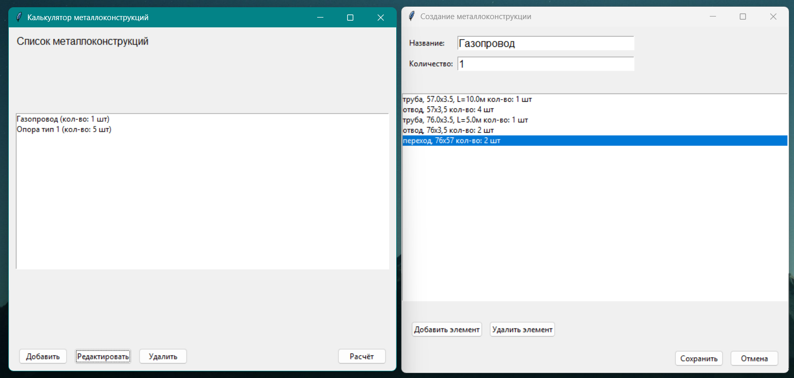

# Metal Calculator (Калькулятор металлоконструкций)

Десктопное приложение для расчета веса и площади окраски металлоконструкций, состоящих из базовых элементов, таких как лист, труба, уголок, отвод, швеллер. Поможет в сметных расчетах.

### Скриншоты:


### Возможности программы
- Расчет веса и площади окраски для 10+ типов элементов (лист, труба, уголок, отвод, балка и др.)
- Поддержка марок стали из справочника (можно расширять)
- Удобный графический интерфейс на `tkinter`
- Сохранение и редактирование конструкций
- Экспорт отчета с общими ведомостями
- Упаковка в '.exe' для Windows

#### Поддерживаемые типы элементов

- Лист, круг, труба, труба профильная, уголок, заглушка — ввод геометрических параметров
- Отводы, переходы, балки, швеллеры — выбор типоразмера из справочника (Только для стали Ст3)
- Материал — выбор марки стали из справочника (Ст3, 09Г2С, 12Х18Н10Т и др. - для элементов с вводом геометрических параметров)

### Поддерживаемые операционные системы:
- **Windows 10 и новее** - работает полностью (сборка в `exe`)
- **Windows 7 и старше** - не поддерживается
- **Linux** - работает из исходного кода (требуется установка tkinter через `sudo apt install python3-tk`)
- **macOS** - теоретически должно работать, но не тестировалось

### Установка и запуск программы
Клонировать репозиторий:
```
git clone https://github.com/TerrAAAn/metal-calculator-desktop.git
cd metal-calculator-desktop
```
Установить зависимости:
```
uv sync
```
Запустить приложение:
```
uv run python src/main.py
```
### Сборка в .exe (Для Windows)
```
# Установить pyinstaller
pip install pyinstaller

# Собрать приложение (Запуск из директории с клонированным репозиторием - команда для Windows):
python -m PyInstaller --onefile --windowed --add-data "data;data" --name "MetalCalculator" src\main.py
```
### Для пользователей (без установки Python)

1. Перейдите в раздел [Releases](https://github.com/TerrAAAn/metal-calculator-desktop/releases)
2. Скачайте файл `MetalCalculator.exe`
3. Запустите его двойным кликом

Ничего дополнительно устанавливать не требуется. Программа работает на Windows 10 и новее.
### Использование:
Нажать "Добавить" -> создать новую конструкцию, дать ей имя и задать количество таких конструкций.

Нажать "Добавить элемент" -> выбрать тип "Труба", ввести диаметр, толщину, длину, количество.

Добавить "Отводы" и "Переходы" из справочника.

Нажать "Сохранить конструкцию".

В главном окне нажать "Расчёт" → получить итоговый вес и площадь окраски.

